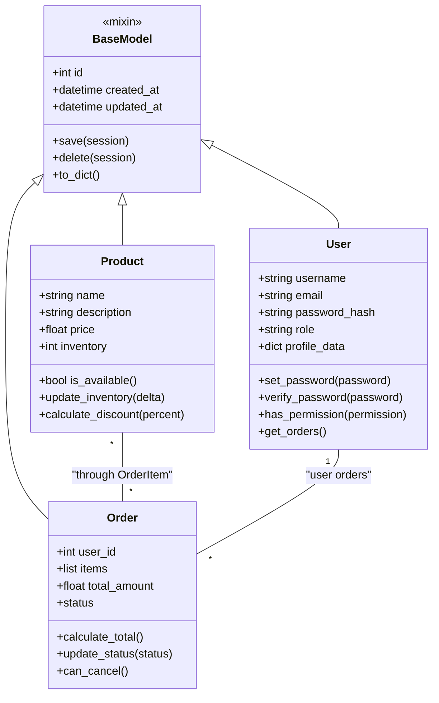

# Class diagrams — domain model

This document sketches the core domain classes and relationships using Mermaid UML.

Notes: OrderItem and other helpers are either entities or value objects depending on your design: in this project we keep `OrderItem` as a simple model referencing `Product` and the `Order` aggregate.
